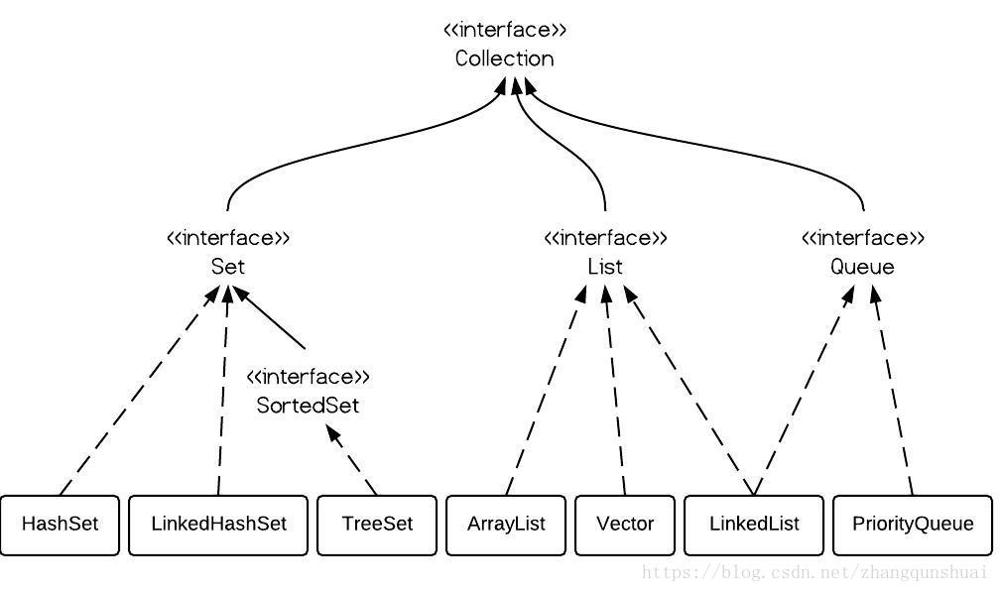
#Collection
List , Set,Queue继承至Collection接口  
List下有ArrayList，LinkedList，Vector  
Set下有HashSet，LinkedHashSet，TreeSet  
LinkedList既可以实现Queue接口,也可以实现List接口.SortedSet是个接口，  
它里面的（只有TreeSet这一个实现可用）中的元素一定是有序的。  
## List 有序,可重复  
ArrayList  
优点: 底层数据结构是数组，查询快，增删慢。  
缺点: 线程不安全，效率高  
List常用方法  
add()//添加;set()修改;remove()删除;contains();判断一个元素是否在另一个元素  
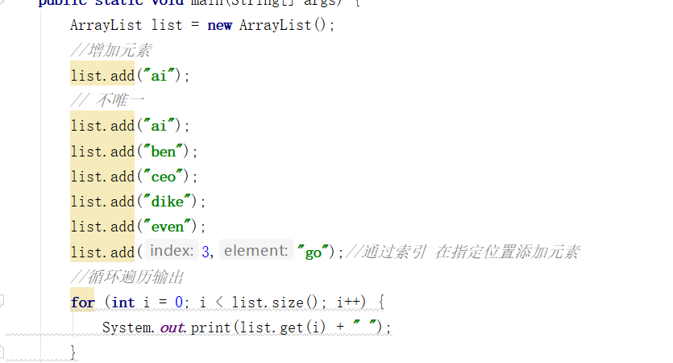  
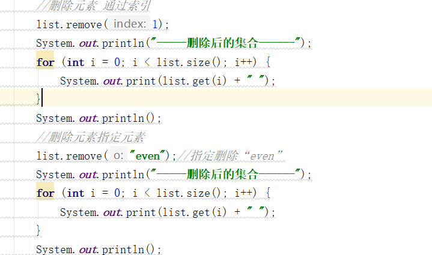  
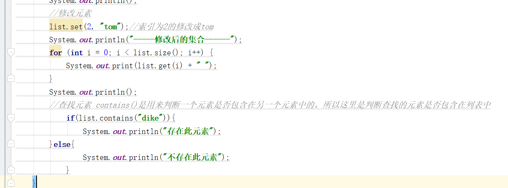  
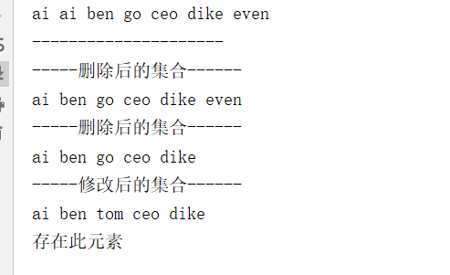  
LinkedList  
优点: 底层数据结构是链表，查询慢，增删快。  
缺点: 线程不安全，效率高  
##—Set 无序,唯一  
HashSet  
底层数据结构是哈希表。(无序,唯一)  
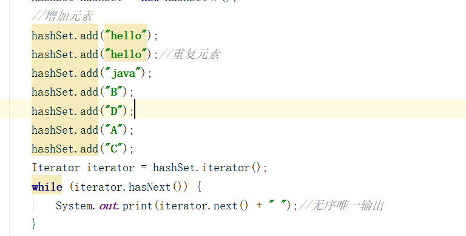  
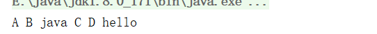  
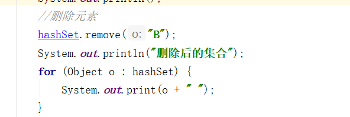  
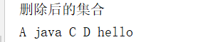  
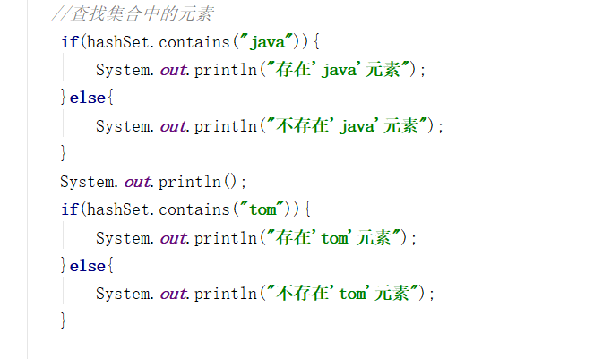  
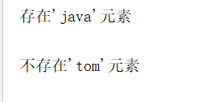  
TreeSet  
底层数据结构是红黑树。(唯一，有序)  
  
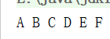  
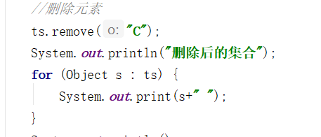  
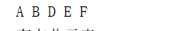  
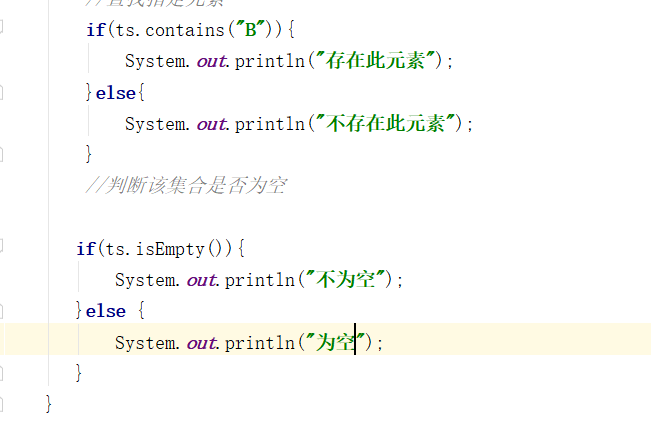  
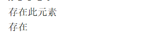  
##如何使用集合场景  

唯一吗?
  
是：Set   

排序吗?  

是：TreeSet或LinkedHashSet  
否：HashSet  
如果你知道是Set，但是不知道是哪个Set，就用HashSet。  

否：List  

要安全吗?  

是：Vector  
否：ArrayList或者LinkedList  

查询多：ArrayList  
增删多：LinkedList  
TreeSet的主要功能用于排序  
LinkedHashSet的主要功能用于保证FIFO即有序的集合(先进先出)  
HashSet只是通用的存储数据的集合  
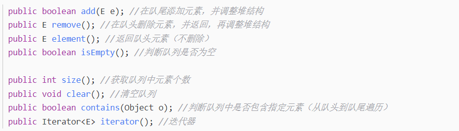  
```public static void main(String[] args) {
          //声明一个PriorityQueue
          PriorityQueue priorityQueue = new PriorityQueue();
          priorityQueue.offer(6);//入队
          priorityQueue.offer(-3);
          priorityQueue.offer(20);
          priorityQueue.offer(18);
          System.out.println(priorityQueue);
          //队列不为空取出元素
          while(!priorityQueue.isEmpty()) {
              //poll方法取出且删除
              //peek()方法取出队列头部元素时候，不删除该元素
              System.out.print(priorityQueue.poll()+" ");
          }
          //-3 6 18 20
           System.out.println(priorityQueue);//[]
      }```
      
