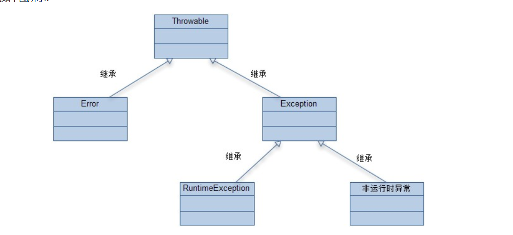
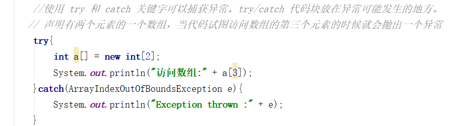
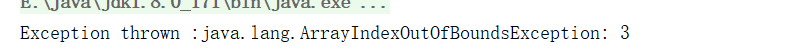
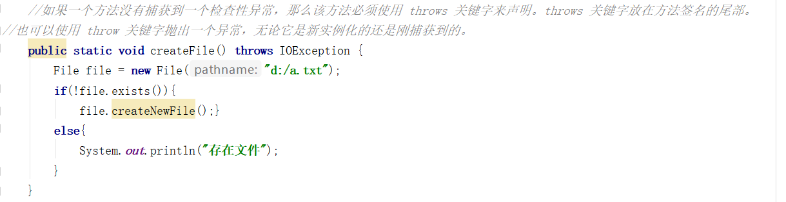
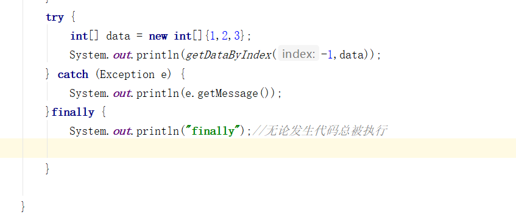
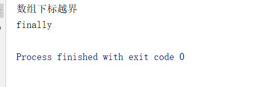

#异常处理
  
在Java中如果需要处理异常，必须先对异常进行捕获，  
然后再对异常情况进行处理。使用try和catch关键字即可  
  
  
被try块包围的代码说明这段代码可能会发生异常  
一旦发生异常，异常便会被catch捕获到，然后需要在catch块中进行异常处理。  
在Java中还提供了另一种异常处理方式即抛出异常，顾名思义，也就是说一旦发生异常，我把这个异常抛出去，让调用者去进行处理，
自己不进行具体的处理，此时需要用到throw和throws关键字。  
    
   
   
 ##Finally:无论发生什么代码总被执行
 
