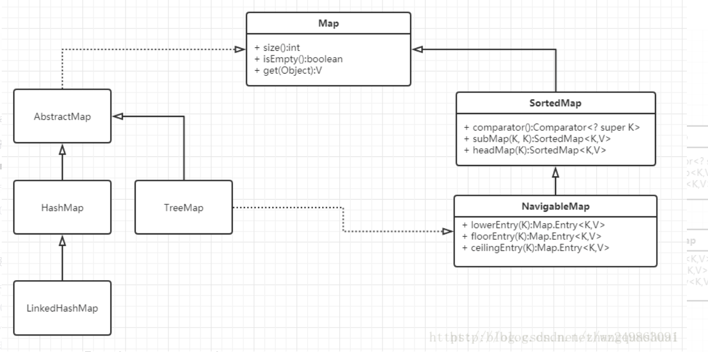
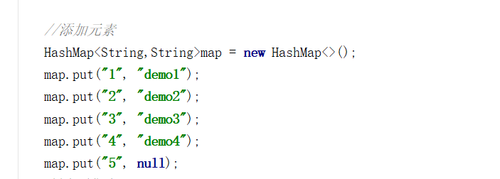
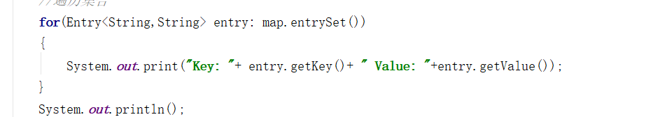
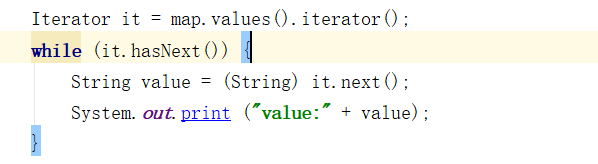
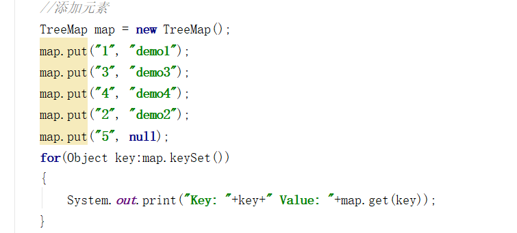
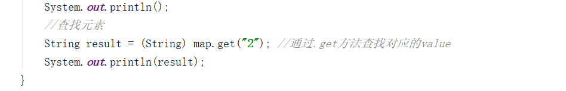

  
Map接口有两个个比较重要的实现类，分别是HashMap、TreeMap  
TreeMap是有序的，HashMap是无序的。  
两者都是线程不安全  
所以效率比较高  
TreeSet的主要功能用于排序  
HashSet只是通用的存储数据的集合  
#Set 三种遍历方式  
通过Entry  getKey（）来获取  
  
  
通过ketset循环 get（key）来获取值  
  
通过迭代 获取value值  
   
  
##TreeSet的有序
  
  
 
     ```//修改元素
       if(map.containsKey("2"))//判断是否存在
       {
           map.put("2", "demo22");
       }else{
           System.out.println("不存在该元素无法修改");
       }
        for(String key:map.keySet())
        {
            System.out.print("Key: "+key+" Value: "+map.get(key));
        } 
  
查找方法 通过key值来查找  
  
demo22


