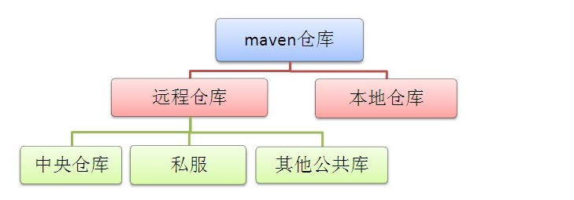
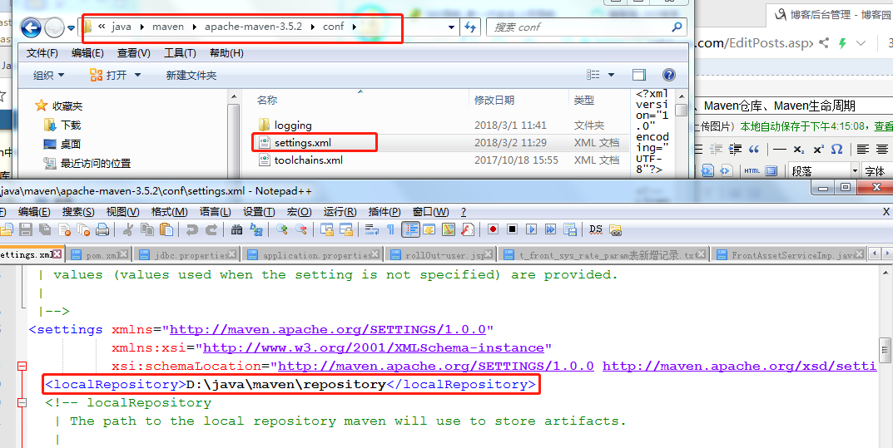

#Maven  
一、Maven坐标  
　　maven坐标概念：每个构件都有自己的一个标识（唯一的），它由groupId,artifactId,version等信息组成，因此maven就可以对构件进行版本控制、管理。  
　　备注:  
　　groupId ：公司名称或者组织名称；  
　　artifactId：项目名称；  
　　version：当前项目的版本号。  
　　上边定义maven的概念时提到了构件，那么什么是构件呢?  
　　------在maven中任何依赖（jar包）、项目输出（通过其他工具打包的jar、war等）都可以称为构件。  
　　packing：定义maven项目打包的方式，也可以通过定义打包成war等；当不定义packing时，maven就会使用默认值jar。  
　　classifer：表示在相同版本下针对不同的环境或者jdk使用的jar，如果配置了这个元素，则将这个元素的名称附加到报名的后边。例如：json-0.1-jdk1.6.jar。  
 
二、Maven仓库  
　　maven仓库定义：在maven中会有一个统一存储所有项目的共享构建的位置，这个统一的位置，我们就称之为仓库。  
　　maven仓库的分类：本地仓库、远程仓库。  
　　其中远程仓库有分为三种：中央仓库、私服、其他公共仓库。  
　　示意图：
  
1、本地仓库：maven在本地存储构件的地方。  
　　本地仓库是指存在于我们本机的仓库，在我们加入依赖时候，首先会跑到我们的本地仓库去找，如果找不到则会跑到远程仓库中去找。对于依赖的包大家可以从这个地址进行搜索：http://mvnrepository.com/。  　　
　　（1）maven本地仓库默认位置  
　　无论windows还是linux环境，都是默认位置都是在用户的目录下的一个./m2/repository/仓库目录，这就是maven仓库的默认位置。  
　　（2）maven本地仓库默认位置修改  
　　通过修改配置文件settings.xml中的localRepository标签，就可以实现。 
    
　1、远程仓库
 　　远程仓库是指其他服务器上的仓库，包括全球中央仓库，公司内部的私服，又或者其他公司提供的公共库。后面会专门聊聊私服，公共库的话只是一个地址，大家会引用就行了。
 
三、Maven生命周期  
　　 maven声明周期概念：它是对所有的构建过程进行抽象和统一。包含了项目的清理、初始化、编译、测试、打包、集成测试、验证、部署和站点生成等几乎所有的构建过程步骤。  
　　1、Clean   ：在进行构件之前进行一些清理工作  
　　（1）pre-clean：执行清理前需要完成的工作；  
　　（2）clean：清理上一次构建生成的文件；  
　　（3）post-clean：执行清理后需要完成的工作。  
　　2、Default：构件的核心部分：编译、测试、打包、部署等  
　　（1）validate：验证工程是否正确，所有需要的资源是否可用；  
　　（2）compile：编译项目的源代码；  
　　（3）test：使用合适的单元测试框架来测试已经编译的源代码，该测试不需要打包和部署。  
　　（4）package：把已编译的代码打包发成可发布的格式，比如：jar；  
　　（5）integration-test：如有需要将包处理和发布一个能够进行集成测试的环境。  
　　（6）verify：运行所有检查，验证包是否有效且达到质量标准；  
　　（7）install：把包安装到maven本地仓库，可以被其他工程作为依赖来使用；  
　　（8）deploy：在集成或者发布环境下执行，将最终版本的包拷贝到远程的repository，使得其他的开发者或者工程可以共享。  
　　3、Site ：生成项目报告、站点，站点发布。  
　　（1）pre-site：生成项目站点之前需要完成的工作；  
　　（2）site：生成项目站点文档；  
　　（3）post-site：生成项目站点之后需要完成的工作；  
　　（4）site-deploy：将项目站点文件发布到服务器。  

